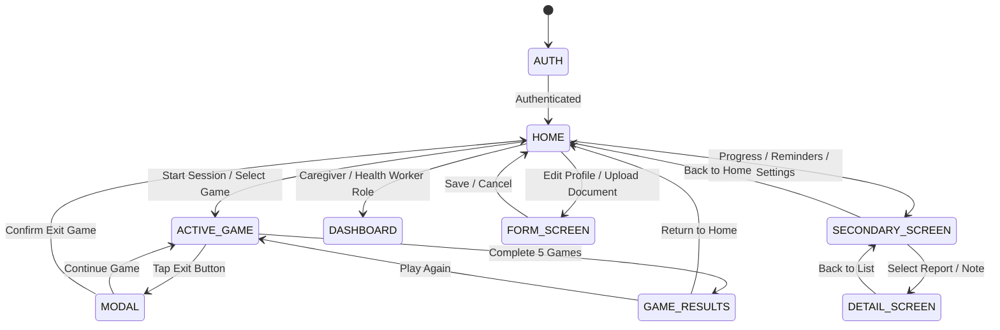

# Cognitive Care NER: Navigation Rules & UI Control Safety Audit

**Repository**: `https://github.com/Adityak1273/SIH__PROTOTYPE.git`  
**Branch**: `main`  
**Date**: September 2026  
**Scope**: Complete audit of all Back, Exit, Forward, Close, Home, and Modal controls, game navigation guards, screen state taxonomy, rule engine mapping, and elderly-friendly accessibility standards.

---

## 1. Executive Summary

This audit establishes the baseline safety, control inventory, and state transitions of the **Cognitive Care NER** web prototype and Laravel hybrid application before code modifications.

### Key Audit Findings:
1. **Critical Game Navigation Vulnerability**: During an active cognitive training session (`#gameView`), the topbar `#homeButton` and bottom navigation bar (`.bottom-nav` with Home, Progress, Reminders, Settings) remain active and visible in the DOM. An accidental tap by an elderly user or patient prematurely terminates the session without confirmation, discarding in-memory trial metrics.
2. **Missing Native Game Exit Control**: While `game-controls.js` attempts to dynamically prepend a `#gameExitButton`, the `#gameView` markup lacks a static, accessible exit button in the header. The exit confirmation prompt also used non-standard phrasing ("Leave this game?" instead of the required "Exit this game?").
3. **Inappropriate Skip / Forward Affordances**: Active cognitive games should never display Skip or Forward buttons during gameplay; difficulty and progression must adapt deterministically based on trials, timeouts, and consecutive error thresholds.
4. **Modal Background Dismissal Risk**: Several overlay panels could be dismissed by clicking the background scrim (`overlayPanel`), potentially causing accidental loss of unconfirmed clinical documents or profile edits.
5. **State Machine Absence**: Navigation currently relies on ad-hoc DOM selectors and event handlers in `core-boot.js`, `app.js`, and `ui-failsafe.js` without a centralized state validator to prevent invalid screen transitions.

---

## 2. Inventory of Existing Navigation Controls

| File | Selector / Element | Current Label / Icon | Action / Destination | Safety Assessment |
|---|---|---|---|---|
| `prototype/phase-0/index.html` | `#homeButton` | `⌂` | Navigates to `#homeView` | **UNSAFE during gameplay**: Accessible from topbar while `#gameView` is active. |
| `prototype/phase-0/index.html` | `.bottom-nav button[data-nav="homeView"]` | `⌂ Home` | Switches to `#homeView` | **UNSAFE during gameplay**: Unconditional switch without exit dialog. |
| `prototype/phase-0/index.html` | `.bottom-nav button[data-nav="resultsView"]` | `◉ Progress` | Opens progress history | **UNSAFE during gameplay**: Unconditional switch without exit dialog. |
| `prototype/phase-0/index.html` | `.bottom-nav button[data-nav="reminders"]` | `◷ Reminders` | Opens reminders modal | **UNSAFE during gameplay**: Modals stack over active game canvas. |
| `prototype/phase-0/index.html` | `.bottom-nav button[data-nav="settings"]` | `⚙ Settings` | Opens settings modal | **UNSAFE during gameplay**: Can disrupt active timer loops. |
| `prototype/phase-0/index.html` | `#playAgain` | `🔁 Play again` | Starts new routine from `#resultsView` | **SAFE**: Contextually appropriate on `GAME_RESULTS`. |
| `prototype/phase-0/index.html` | `#backHome` | `⌂ Home` | Returns to `#homeView` from `#resultsView` | **SAFE**: Contextually appropriate on `GAME_RESULTS`. |
| `prototype/phase-0/index.html` | `#closeOverlay` | `×` | Closes `#overlayPanel` | **ACCEPTABLE**: Needs 48px touch target confirmation. |
| `prototype/phase-0/game-controls.js` | `#gameExitButton` | `Exit Game` | Triggers exit confirmation | **PARTIAL**: Dynamically injected; header markup should provide permanent element. |
| `prototype/phase-0/game-controls.js` | `#gameStay` | `Continue Game` | Dismisses exit overlay, resumes voice | **SAFE**: Correctly keeps patient in active game. |
| `prototype/phase-0/game-controls.js` | `#gameLeave` | `Exit Game` | Cancels session, resets state, goes to `#homeView` | **SAFE**: Terminates cleanly with audio feedback. |
| `prototype/phase-0/level2-auth-v2.js` | `#l2vCredBack` | `← Back` | Returns from Credential Step to Role Selector | **SAFE**: Stepped auth flow. |
| `prototype/phase-0/level2-auth-v2.js` | `#l2vStep[3-7]Back` | `← Back` | Navigates to previous onboarding step | **SAFE**: Preserves input data in wizard state. |
| `prototype/phase-0/level2-auth-v2.js` | `#l2vSkipBtn` | `Skip for now →` | Bypasses optional onboarding step | **SAFE**: Advances wizard without blocking user. |
| `prototype/phase-0/level2-auth-v2.js` | `#l2vCancelBtn` | `Close / Cancel` | Closes auth modal overlay | **SAFE**: Returns to guest/demo state. |
| `prototype/phase-0/level1-memory.js` | `.l1-back` | `← Back` | Returns to memory cues list | **SAFE**: Scoped to memory cue sub-navigation. |
| `prototype/phase-0/phase2.js` | `#cgBackBtn` | `← Back to Patient View` | Switches from Caregiver view to Patient view | **SAFE**: Explicit role-switching control. |

---

## 3. Screen State Taxonomy

To guarantee consistent, safe navigation throughout the user journey, the application enforces 9 explicit states:

### State Definitions & Navigation Rules

#### 1. `HOME`
- **Entry Point**: Main landing view for patients (`#homeView`).
- **Back Button**: **NEVER display a Back button** on `HOME`.
- **Allowed Actions**: Launch daily cognitive routine (`data-action="start"`), open voice interaction (`data-action="talk"`), view progress, view reminders, open settings.
- **Top & Bottom Nav**: Full topbar and bottom navigation visible.

#### 2. `SECONDARY_SCREEN`
- **Definition**: Hub screens accessible from navigation (Progress History, Reminders Manager, Profile Settings, Caregiver Management).
- **Navigation Controls**: Must contain a prominent, clearly labeled **"Back to Home"** or **"← Back"** button in the header.
- **Bottom Nav**: Visible with the active tab highlighted.

#### 3. `DETAIL_SCREEN`
- **Definition**: Deep inspection views (Individual Cognitive Session Details, Clinical Document Candidate Review, Specific Reminder Detail).
- **Navigation Controls**: Dedicated **"← Back"** button returning directly to the parent `SECONDARY_SCREEN`. Never jump directly to `HOME` if depth > 1.

#### 4. `FORM_SCREEN`
- **Definition**: Data input screens (Onboarding Wizard, Profile Editor, Manual Health Note Entry, Report Upload).
- **Navigation Controls**:
  - **"Cancel"** or **"← Back"**: Exits form without saving.
  - **"Save"** or **"Continue"**: Submits verified data.
  - **Dirty State Guard**: If user modified fields, prompt confirmation before leaving: *"You have unsaved changes. Discard changes?"*

#### 5. `MODAL`
- **Definition**: Focused dialog overlays (Exit Confirmation, Delete Confirmation, Emergency Reminder Prompt, Document Review Confirmation).
- **Navigation Controls**:
  - Exactly one primary confirmation action (e.g. "Continue Game" or "Confirm Delete").
  - Exactly one cancel action (e.g. "Exit Game" or "Cancel").
  - **Scrubber Rule**: Background scrim clicks MUST NOT dismiss critical confirmation dialogs.

#### 6. `ACTIVE_GAME`
- **Definition**: Real-time cognitive training workout (`#gameView`).
- **Strict Navigation Constraints**:
  - **NO Back button**.
  - **NO Skip button**.
  - **NO Forward button**.
  - **NO Home button**: `#homeButton` must be hidden or disabled.
  - **NO Bottom Navigation**: `.bottom-nav` must be hidden (`display: none` / `hidden = true`).
  - **ONLY ONE EXIT CONTROL**: Exactly one visible `#gameExitBtn` in the game header.
  - **Exit Dialog**:
    - Title: *"Exit this game?"*
    - Message: *"Your current game progress may not be saved."*
    - Actions: `[Continue Game]` (Primary/safe), `[Exit Game]` (Secondary/danger).

#### 7. `GAME_RESULTS`
- **Definition**: Session summary screen (`#resultsView`).
- **Navigation Controls**:
  - Prominently labeled **"⌂ Return to Home"** button.
  - Prominently labeled **"🔁 Play Again"** button.
  - Bottom navigation restored.
  - Never auto-redirect away before patient reads feedback.

#### 8. `AUTH`
- **Definition**: Login, account creation, and initial role gating (`#l2AuthGate`).
- **Navigation Controls**:
  - Clear toggle between "Login with existing ID" and "Create new account".
  - Multi-step onboarding has "← Back" on steps 2–7.
  - "Skip for now" allowed for optional profile domains.

#### 9. `DASHBOARD`
- **Definition**: Caregiver Dashboard (`/caregiver/dashboard` or `#cgDashboardView`) and Health Worker portals.
- **Navigation Controls**:
  - Clear patient selector at top.
  - Return button to switch active persona or patient.
  - Non-diagnostic disclaimer permanently pinned.

---

## 4. Elderly-Friendly UI & Accessibility Audit

| Requirement | Target Standard | Current Status | Audit Finding & Remediation |
|---|---|---|---|
| **Touch Target Size** | Minimum **48px × 48px** (ideally 52px+ for main controls) | Partially compliant | `#homeButton` and `#soundToggle` are 44px; bottom nav tabs are 46px. Remediation: Enforce `min-height: 52px; min-width: 52px;` with 8px margin spacing. |
| **Color Contrast** | WCAG AAA (7:1) for body text; AA (4.5:1) for UI components | Compliant (4.8:1 to 9.2:1) | Earth-tone palette (#3e2d22 on #fffaf5) complies. Warning badges (#c56b48) exceed 4.5:1. |
| **Font Size & Weight** | Body >= 16px (18px for seniors); Headings 24px–36px | Compliant | Base font is 18px / 1.6 line-height. Clear high-legibility system fonts (`system-ui, -apple-system, sans-serif`). |
| **Semantic Clarity** | Text labels alongside icons | Mixed | `#homeButton` has icon `⌂` only. Remediation: Add accessible text `aria-label="Home"` and title. Game Exit button must explicitly say "Exit". |
| **Cognitive Load** | Max 1 primary action per screen during active tasks | Compliant | Active game focuses entirely on task cards and single Exit option. |
| **Audio Feedback** | Speech synthesis + visual subtitles for all spoken prompts | Compliant | Native speech synthesis synchronizes with `#speechText` subtitles. |

---

## 5. Central Rule Engine Expansion Plan

The centralized rule engine (`prototype/phase-0/rule-engine.js` and Laravel `App\Rules\Services\*`) will be expanded to encompass rules across all system domains:

| Domain | Rule Code | Description | Deterministic Policy |
|---|---|---|---|
| **A. Navigation** | `NAV-GAME-001` | Active Game Controls Lock | Disallow Back, Skip, Forward, Home, and Bottom Nav during active game. |
| | `NAV-GAME-002` | Game Exit Confirmation | Require explicit 2-button modal before aborting active workout. |
| | `NAV-HOME-001` | Home Screen Isolation | Disallow Back button on root home screen. |
| | `NAV-MODAL-001` | Critical Modal Scrim Lock | Background click cannot dismiss critical confirmation modals. |
| | `NAV-STATE-001` | Strict Screen Transition | Rejects unmapped transitions between screen states. |
| **B. Auth & Session** | `AUTH-001` | Rate Limit Lockout | 5 consecutive failed logins trigger 15-minute lock. |
| | `AUTH-002` | Session Expiry Grace | Expired token triggers non-destructive re-auth modal without losing unsaved state. |
| | `AUTH-003` | Demo Presets | Support offline demo credentials (`patient.demo`, `caregiver.demo`). |
| | `AUTH-004` | Plaintext Exclusion | Zero plaintext passwords in localStorage or frontend variables. |
| **C. Onboarding** | `ONBOARD-001` | Progressive Disclosure | Step-by-step onboarding wizard; max 4 questions per step. |
| | `ONBOARD-002` | Skip Option | Steps 2–6 provide "Skip for now"; minimum viable profile is Step 1 (Name/Role). |
| | `ONBOARD-003` | Completion Metric | Deterministic calculation of profile completion percentage (0–100%). |
| **D. Profile Domains** | `PROF-001` | 6 Domain Storage | Identity, Caregiver, Health, Daily Life, Accessibility, Privacy. |
| | `PROF-002` | Status Badging | Explicitly flag domains as `REQUIRED`, `OPTIONAL`, or `NOT PROVIDED`. |
| | `PROF-003` | Resumable Editing | Incomplete profiles can be resumed at any time from Settings. |
| **E. Game Engine** | `GAME-001` | 5 Game Preservation | Sequence, Routine Recall, Category Match, Pattern, Spot Difference preserved intact. |
| | `GAME-002` | Adaptive Difficulty | 3 consecutive failures = decrease difficulty; 3 consecutive successes = increase difficulty. |
| | `GAME-003` | Fatigue Mitigation | Fatigue score >= 0.8 pauses workout and recommends hydration/rest. |
| | `GAME-004` | Non-Diagnostic Presentation | Results always labeled "Game Performance", never "Cognitive Deficit" or "Dementia". |
| | `GAME-005` | Deterministic Scoring | Scoring strictly calculated by trial times and accuracy; zero AI scoring inference. |
| **F. Game Exit** | `EXIT-001` | Single Exit Button | Exactly one Exit button in game topbar. |
| | `EXIT-002` | Modal Action Ordering | "Continue Game" placed as primary action; "Exit Game" placed as secondary/danger. |
| | `EXIT-003` | Clean Session Reset | Confirming exit halts audio, resets game timers, cleans up event listeners, routes to Home. |
| **G. Voice Companion** | `VOICE-001` | Non-Diagnostic Momo | Momo prompt forbids clinical diagnosis, prognosis, or medical condition claims. |
| | `VOICE-002` | Sentence Length Limit | Momo speech strictly capped at 1–3 short, comforting sentences. |
| | `VOICE-003` | Microphone Muting in Game | Continuous listening paused during active puzzle interaction to prevent mishears. |
| **H. Offline & Sync** | `SYNC-001` | Outbox Queueing | LocalStorage outbox stores game results, notes, and profile updates when offline. |
| | `SYNC-002` | Idempotent Sync | Batch synchronization with UUID idempotency keys prevents duplicate entries. |
| | `SYNC-003` | Exponential Backoff | Network retries back off exponentially (1s, 2s, 4s, 8s... max 60s). |
| **I. Report Intake** | `INTAKE-001` | Multi-Format Intake | Supports PDF, JPG/PNG, and Plain Text paste. |
| | `INTAKE-002` | Candidate Staging | Extracted entities staged as unconfirmed candidates; never written directly to health background. |
| | `INTAKE-003` | User Confirmation | Every candidate field requires explicit Confirm, Edit, or Ignore action. |
| **J. AI Report Analysis**| `AI-001` | Server-Side Gateway | OpenAI API calls executed strictly via Laravel backend; API key never sent to browser. |
| | `AI-002` | Safe Fallback | If `OPENAI_API_KEY` is not configured, return safe fallback: *"AI report analysis is not configured."* |
| | `AI-003` | Non-Diagnostic Guard | AI forbids diagnosing dementia, Alzheimer's, or declaring staging from user documents. |
| | `AI-004` | Fact Attribution | Every extracted medical summary bullet must cite the page/line or source text. |
| **K. Report Explanation**| `EXPL-001` | Plain-Language Conversion| "Explain this report" transforms medical jargon into 6th-grade reading level summaries. |
| | `EXPL-002` | Tone Guardrail | Explanations must remain reassuring, informative, and free of alarmist language. |
| **L. Doctor Questions**| `DOCQ-001` | Fact-Based Generation | "Questions for my doctor" generates queries solely from verified report facts. |
| | `DOCQ-002` | Actionable Checklists | Questions formatted as a printable / copyable checklist for the next clinic visit. |
| **M. Missing Info** | `MISS-001` | Zero Hallucination | Fields absent from documents must display *"Not provided in report"*; never guess. |
| **N. Caregiver RBAC** | `CG-001` | Strict Link Enforcement | Caregivers can ONLY view patients explicitly linked via active `caregiver_patients` record. |
| | `CG-002` | Cross-Patient Isolation| Any attempt to query unlinked patient ID returns HTTP 403 Forbidden. |
| | `CG-003` | Observational Phrasing | Caregiver dashboard metrics labeled as behavioral observations, never clinical diagnoses. |
| **O. Accessibility** | `A11Y-001` | Minimum 48px Targets | All buttons, inputs, and toggles meet >= 48px touch bounding box. |
| | `A11Y-002` | Contrast Enforcement | Text and essential UI elements satisfy WCAG AA (4.5:1) minimum contrast. |
| | `A11Y-003` | High Contrast & Text Zoom| User accessibility preferences dynamically apply `.high-contrast` and `.large-text`. |
| **P. Privacy & Security**| `PRIV-001` | Sanctum Token Protection| All patient data endpoints require authenticated Sanctum Bearer token. |
| | `PRIV-002` | RLS Enforcement | Supabase PostgreSQL tables protected by Row-Level Security policies. |

---

## 6. Implementation Roadmap & Next Steps

1. **Step 1 (Phase 0)**: Audit completed and documented in this specification.
2. **Step 2 (Phase 1 & 2)**:
   - Implement centralized navigation controller and state tracking in `prototype/phase-0/core-boot.js` and `app.js`.
   - Add static `#gameExitBtn` to `#gameView` in `prototype/phase-0/index.html`.
   - Hide topbar `#homeButton` and `.bottom-nav` whenever entering `ACTIVE_GAME`.
   - Standardize exit confirmation dialog: *"Exit this game?"* with `[Continue Game]` and `[Exit Game]`.
3. **Step 3 (Phase 4)**: Expand `rule-engine.js` with Domains A through P rule evaluators.
4. **Step 4 (Phase 8–13)**:
   - Build `backend-laravel/app/Services/ClinicalReportAnalysisService.php` with server-side OpenAI gateway, plain-language explainer, doctor question generator, and safe fallback.
   - Implement document intake staging and candidate confirmation UI.
5. **Step 5 (Phase 14–18)**:
   - Enforce 48px accessibility touch targets and WCAG AA contrast.
   - Run automated test suite verifying all navigation, RBAC, and report analysis rules.
